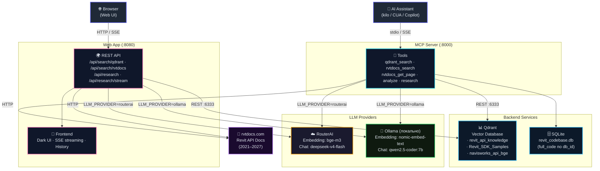

# RevitNavisResearcher MCP Server

**MCP-сервер** для семантического поиска по документации **Revit API**, **Revit SDK Samples** и **Navisworks API** с использованием векторной БД Qdrant и LLM (RouterAI).

---

## 🚀 Быстрый старт

### 1️⃣ Предварительные требования

- Python 3.12+
- Docker (опционально, для запуска через Docker)
- API-ключ [RouterAI](https://routerai.ru/settings/keys)

### 2️⃣ Установка

```bash
# Клонировать репозиторий
git clone <repo-url>
cd RevitNavisResercher

# Создать и активировать виртуальное окружение
python -m venv .venv
.venv\Scripts\activate  # Windows
# source .venv/bin/activate  # Linux/Mac

# Установить зависимости
pip install -r requirements.txt

# Настроить окружение
cp .env.example .env
# Отредактировать .env — указать ROUTERAI_API_KEY
```

### 3️⃣ Запуск

```bash
# Режим stdio (для интеграции с kilo / AI assistant)
python mcp_server.py

# Режим SSE (HTTP-сервер на порту 8000)
$env:MCP_TRANSPORT="sse"; python mcp_server.py
```

### 4️⃣ Docker

```bash
# Собрать и запустить полный стек (MCP + Qdrant)
docker compose up -d

# Или только MCP-сервер (если Qdrant уже запущен)
docker build -t revitnavis-mcp .
docker run -p 8000:8000 -e ROUTERAI_API_KEY=sk-xxx revitnavis-mcp

#через .env
docker compose --env-file .env up -d
```

---

## 📚 Инструменты MCP

| Инструмент | Описание |
|-----------|----------|
| `qdrant_search` | Семантический поиск по коллекциям Qdrant (Revit API, SDK Samples, Navisworks) |
| `qdrant_collection_info` | Метаданные коллекции: размер, статус, настройки векторов |
| `qdrant_list_collections` | Список всех доступных коллекций |
| `qdrant_get_point` | Получение конкретного документа из Qdrant по ID |
| `rvtdocs_search` | Поиск по Revit API документации на rvtdocs.com |
| `rvtdocs_get_page` | Полное содержимое страницы документации с примерами кода |
| `rvtdocs_cross_version_search` | Поиск по Revit API сразу во всех версиях (2021–2027) |
| `analyze` | Анализ результатов поиска через LLM (deepseek-v4-flash) |
| `research` | Полный пайплайн: Qdrant → rvtdocs (все версии) → LLM → ответ |

---

## ⚙️ Конфигурация

### Переменные окружения (`.env`)

| Переменная | По умолчанию | Описание |
|-----------|-------------|----------|
| `ROUTERAI_API_KEY` | — | API-ключ RouterAI **(обязательно для routerai)** |
| `ROUTERAI_BASE_URL` | `https://routerai.ru/api/v1` | Базовый URL RouterAI |
| `EMBEDDING_MODEL` | `baai/bge-m3` | Модель эмбеддингов (RouterAI) |
| `LLM_MODEL` | `deepseek/deepseek-v4-flash` | Модель LLM для анализа (RouterAI) |
| `LLM_PROVIDER` | `routerai` | Провайдер LLM: `routerai` или `ollama` |
| `OLLAMA_BASE_URL` | `http://localhost:11434` | URL локальной Ollama |
| `OLLAMA_EMBEDDING_MODEL` | `nomic-embed-text` | Модель эмбеддингов Ollama |
| `OLLAMA_CHAT_MODEL` | `qwen2.5-coder:7b` | Модель LLM Ollama |
| `QDRANT_URL` | `http://localhost:6333` | URL Qdrant |
| `MCP_TRANSPORT` | `stdio` | Транспорт: `stdio` или `sse` |
| `MCP_HOST` | `0.0.0.0` | Хост для SSE-режима |
| `MCP_PORT` | `8000` | Порт для SSE-режима |

### YAML-конфиг (`mcp_config.yaml`)

Дополнительные настройки вынесены в `mcp_config.yaml`:
- Параметры HTTP-клиента (таймауты, retry)
- Настройки вывода (лимиты символов)
- Поддерживаемые версии Revit
- Настройки логирования

> Переменные окружения имеют приоритет над YAML-конфигом.

---

## 🦙 Локальный режим с Ollama

Для работы без API-ключа можно использовать локальную [Ollama](https://ollama.com):

```bash
# Установить Ollama (один раз)
winget install Ollama.Ollama  # Windows
# или скачать с https://ollama.com/download

# Запустить Ollama
ollama serve

# В другом терминале — скачать модели
ollama pull nomic-embed-text     # для эмбеддингов
ollama pull qwen2.5-coder:7b     # для LLM (~4.7 ГБ)
```

Настроить `.env`:

```
LLM_PROVIDER=ollama
OLLAMA_BASE_URL=http://localhost:11434
OLLAMA_EMBEDDING_MODEL=nomic-embed-text
OLLAMA_CHAT_MODEL=qwen2.5-coder:7b
# ROUTERAI_API_KEY можно не указывать
```

После этого `research`, `analyze` и Web App будут работать через локальную Ollama.

> **Важно:** Ollama должна быть запущена (`ollama serve`) до старта MCP-сервера или Web App.

Файл `docker-compose.yml` поднимает:
- **MCP-сервер** — на порту `8000` (SSE-режим)
- **Web App** — REST API + фронтенд на порту `8080`
- **Qdrant** — векторная БД на порту `6333` (REST) / `6334` (gRPC)

```bash
docker compose up -d
```

---

## 🌐 Web App (REST API + Frontend)

Кроме MCP-сервера, проект включает веб-приложение на FastAPI с современным тёмным UI:

### Запуск локально

```bash
python web_app.py
# или с авто-перезагрузкой:
python web_app.py --reload
```

Откройте `http://localhost:8080` в браузере.

### Возможности Web UI

- Поиск сразу по нескольким коллекциям Qdrant
- Параллельный поиск в Qdrant + rvtdocs.com
- **SSE-стриминг** ответа LLM (потоковая генерация)
- История поиска (сохраняется в localStorage)
- URL-параметры (шаринг результата через ссылку)
- Авто-определение версии Revit

### API Endpoints

| Endpoint | Описание |
|----------|----------|
| `GET /` | Главная страница (фронтенд) |
| `GET /api/config` | Конфигурация сервера (коллекции, версии, модели) |
| `POST /api/search/qdrant` | Семантический поиск по Qdrant |
| `POST /api/search/rvtdocs` | Поиск по документации rvtdocs.com |
| `POST /api/research` | Полный пайплайн: Qdrant + rvtdocs + LLM |
| `POST /api/research/stream` | Полный пайплайн с SSE-стримингом |

### Docker

```bash
# Запуск только веб-приложения:
docker compose up -d web-app
```

---

## 🧪 Примеры использования

```text
# Найти метод для создания стены в Revit API
qdrant_search(query="create wall with parameters", collection="revit_api_knowledge", limit=5)

# Поиск на rvtdocs.com
rvtdocs_search(query="Wall.Create", version="2024")

# Полный research-пайплайн
research(query="how to create a curtain wall in Revit API", revit_version="2025")
```

---

## 🏗 Архитектура



---

## 🛠 Разработка

```bash
# Установить dev-зависимости
pip install pytest black ruff mypy

# Форматирование
black mcp_server.py

# Проверка типов
mypy mcp_server.py
```

---

## 📄 Лицензия

MIT
